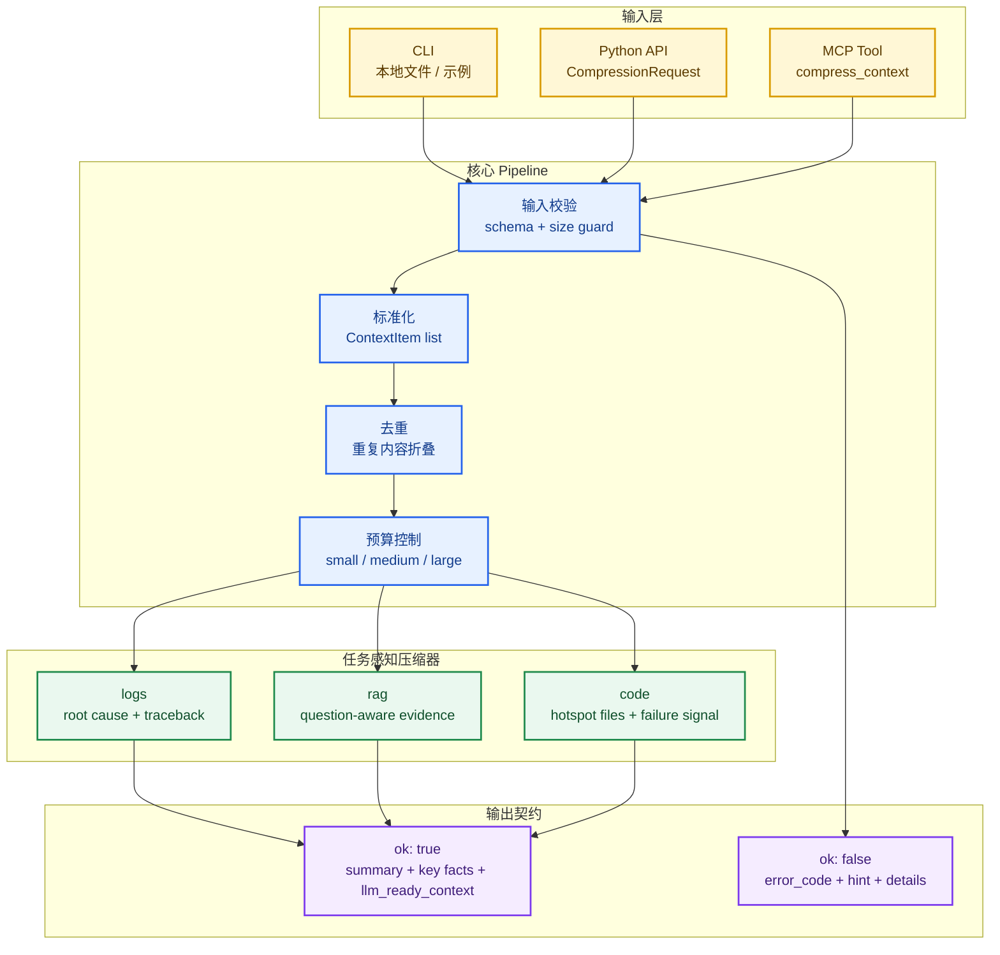
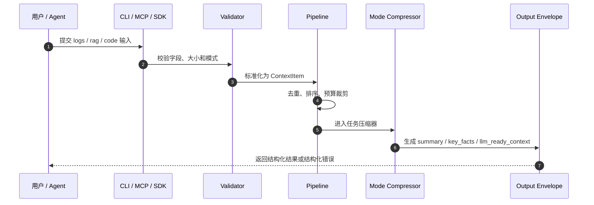

# Context Engine - 面向 Agent / RAG / AI Coding 的上下文压缩引擎

<!-- mcp-name: io.github.melonelish/context-engine -->

<p align="center">
  <strong>把噪声日志、检索片段和代码上下文，压缩成大模型更容易使用的高信号输入。</strong>
</p>

<p align="center">
  面向 Agent 工作流、RAG 管线、AI Coding 助手的任务感知 Context Compression Layer。
</p>

<p align="center">
  
  
  
  
</p>

<p align="center">
  <a href="https://pypi.org/project/melonelish-context-engine/">PyPI</a>
  ·
  <a href="https://github.com/melonelish/context-engine">GitHub</a>
  ·
  <a href="https://registry.modelcontextprotocol.io/v0/servers/io.github.melonelish/context-engine">MCP Registry</a>
</p>

---

## 为什么需要 Context Engine

很多 Agent / RAG / AI Coding 系统的问题，不是“没有上下文”，而是“上下文太脏、太长、太乱”。

日志里有大量重复 heartbeat 和 retry；RAG 检索结果里混着相关与不相关 chunk；代码修复场景里，模型经常拿到一堆文件，却缺少最小修复线索。

`Context Engine` 解决的是这个中间层问题：

> 在把内容交给大模型之前，先按任务类型压缩、排序、去噪，并输出结构化的高信号上下文。

它不是普通摘要工具，而是一个更偏工程化的上下文整理层。

---

## 能力边界问题

| 场景 | 直接丢给模型 | Context Engine |
|:---|:---|:---|
| 长日志 / traceback | 复制全部日志，或者简单截断 | 保留疑似根因、traceback 尾部，折叠重复噪声 |
| RAG 检索结果 | 按检索顺序塞入所有 chunk | 围绕用户问题重新排序，区分高信号与低信号证据 |
| AI Coding 修复 | 把附近文件全部塞进去 | 根据 issue / test output 排序 hotspot file |
| 输入异常 | 抛原始 traceback | 返回结构化错误、错误码和修复提示 |
| Token 不够 | 从头或从尾硬切 | 在标准化和去重后按预算裁剪 |

---

## 系统架构

**核心理念**：先把上下文变成可解释、可预算、可消费的结构，再交给 LLM。



### 数据流



---

## 核心能力

### 1. logs：根因导向的日志压缩

`logs` 模式面向长日志、重复日志、异常栈和混合噪声。

| 能力 | 说明 |
|:---|:---|
| 根因提取 | 优先保留 error、exception、failed、fatal 等关键行 |
| Traceback 保留 | 保留更接近根因的 traceback 尾部 |
| 噪声折叠 | 把重复 heartbeat、poll、retry、duplicate line 归并成计数 |
| LLM-ready 输出 | 生成可以直接放进诊断或修复 prompt 的上下文块 |

### 2. rag：围绕问题的证据重排

`rag` 模式接收 `question` 和 `chunks`，把检索结果从“按召回顺序堆叠”变成“围绕问题排序”。

| 分层 | 含义 |
|:---|:---|
| `HIGH` | 与问题重叠度高，可能直接支持回答 |
| `SUPPORT` | 有帮助但不是核心证据 |
| Low signal | 相关性弱，不应该占据主要上下文窗口 |

### 3. code：最小修复上下文

`code` 模式接收 `issue`、可选 `test_output` 和 `files`，用于给 AI Coding 助手准备更聚焦的修复输入。

| 信号 | 作用 |
|:---|:---|
| Issue terms | 保留用户描述的问题焦点 |
| Failure terms | 把测试失败、异常信息和候选文件关联起来 |
| Hot path hints | 对 test、parser、pipeline、service、validator 等路径加权 |
| Supporting files | 保留辅助上下文，但不让它淹没主线 |

### 4. CLI + MCP 双入口

同一套压缩逻辑可通过三种方式使用：

| 入口 | 用途 |
|:---|:---|
| Python API | 集成到自己的包或服务里 |
| CLI | 本地处理日志、样例和脚本任务 |
| MCP Server | 接入支持 MCP 的 Agent / IDE / 自动化环境 |

---

## 快速开始

### 前置要求

| 项目 | 要求 |
|:---|:---|
| Python | `3.11` 到 `3.13` |
| 包管理器 | `pip` |
| MCP 运行时 | 可选，通过 `mcp` extra 安装 |

### 安装

```powershell
python -m venv .venv
.venv\Scripts\Activate.ps1
python -m pip install -e .[dev,mcp]
```

从 PyPI 安装发布包：

```powershell
python -m pip install "melonelish-context-engine[mcp]"
```

### 运行示例

```powershell
python -m pytest -q
context-engine --mode logs --input examples/logs/sample.log --budget medium
context-engine --mode rag --input examples/rag/sample.json --budget medium
context-engine --mode code --input examples/code/sample.json --budget medium
```

---

## CLI 使用

```powershell
context-engine --mode logs --input examples/logs/sample.log --budget small
context-engine --mode rag --input examples/rag/sample.json --budget medium
context-engine --mode code --input examples/code/sample.json --budget large
```

### 输入格式

#### logs：纯文本

```text
2026-07-03 10:01:12 ERROR payment.worker failed to charge order
Traceback (most recent call last):
  ...
ValueError: missing customer_id
```

#### rag：JSON

```json
{
  "question": "Why did checkout fail?",
  "chunks": [
    {
      "content": "Checkout fails when customer_id is missing.",
      "metadata": {"source": "runbook.md"}
    }
  ]
}
```

#### code：JSON

```json
{
  "issue": "Checkout test fails when customer_id is omitted.",
  "test_output": "ValueError: missing customer_id",
  "files": [
    {
      "path": "src/payments/checkout.py",
      "content": "def checkout(order): ..."
    }
  ]
}
```

---

## MCP 使用

通过 stdio 启动 MCP Server：

```powershell
context-engine-mcp
```

当前暴露一个工具：

| 工具 | 参数 | 功能 |
|:---|:---|:---|
| `compress_context` | `mode`、`budget`、`content` 或 `payload` | 压缩 logs / rag / code 上下文 |

示例错误返回：

```json
{
  "ok": false,
  "error": {
    "error_code": "invalid_field",
    "message": "Field 'chunks' must be a non-empty list.",
    "hint": "Provide at least one item in 'chunks'."
  }
}
```

---

## 输出契约

CLI 和 MCP 都返回统一结构：

| 结果 | 结构 |
|:---|:---|
| 成功 | `{ "ok": true, "result": ... }` |
| 失败 | `{ "ok": false, "error": { "error_code": "...", "message": "...", "hint": "...", "details": ... } }` |

成功结果会包含 schema version、summary、key facts、被丢弃或降权的噪声，以及 `llm_ready_context`。

---

## 安全边界

当前内置限制：

| 限制项 | 当前值 |
|:---|---:|
| 单段文本最大长度 | `200000` 字符 |
| 结构化列表最大数量 | `64` 项 |
| 输入文件最大大小 | `2000000` bytes |
| Schema version | `1.0` |

这些限制用于避免外部工作流把任意超大 payload 直接打进工具。

### 当前已支持

- Python `3.11` 到 `3.13`
- `logs` / `rag` / `code` 三种模式
- 三种模式的 CLI 使用
- 通过 `compress_context` 暴露 MCP 工具
- 纯文本日志输入
- JSON 格式的 RAG 和 code 输入
- 结构化成功 / 失败 envelope
- 基础 benchmark 和 GitHub Actions CI

### 暂不支持

- PDF、图片、Office 文件等二进制输入
- embedding-aware reranking
- 仓库级依赖图分析
- 跨未来大版本的长期兼容性承诺
- 生产级鉴权、持久化、监控和审计能力

---

## Benchmark

Benchmark 资料位于：

- [benchmark_cases.md](benchmarks/benchmark_cases.md)
- [benchmark_results.md](benchmarks/benchmark_results.md)

当前样例集体现的行为：

| 模式 | 对比对象 | 当前效果 |
|:---|:---|:---|
| `logs` | 原始日志 / 简单截断 | 保留根因，折叠重复噪声 |
| `rag` | 直接 dump 检索 chunk | 围绕问题排序证据 |
| `code` | 普通文件摘要 | 保留 issue、失败信号、hotspot file 和支持上下文 |

`v0.1.0` 的 benchmark 还很小，适合作为回归检查和展示样例，不代表完整生产评测。

---

## 开发

```powershell
python -m pip install -e .[dev,mcp]
python -m pytest -q
python benchmarks/generate_benchmarks.py
```

CI 会在 push 和 pull request 时运行安装、测试和 benchmark 生成检查。

---

## 发布状态

当前版本目标：`v0.1.0`

已发布渠道：

- PyPI: https://pypi.org/project/melonelish-context-engine/
- MCP Registry: https://registry.modelcontextprotocol.io/v0/servers/io.github.melonelish/context-engine

这个版本适合早期外部试用、集成测试和开发者工作流验证。它已经具备可复用包结构、测试、文档，以及可直接安装的 PyPI / MCP Registry 发布入口，但仍然是范围明确的早期 beta。

---

## Roadmap

- 引入 embedding 或 reranker 驱动的 RAG 排序。
- 加强 code hotspot 识别，加入更可靠的结构化代码信号。
- 扩展 benchmark，加入更多真实脏数据样本。
- 发布更易安装的正式包版本。
- 增加更多 Agent Runtime / MCP 集成示例。

---

## License

本项目采用 [MIT License](LICENSE)。
